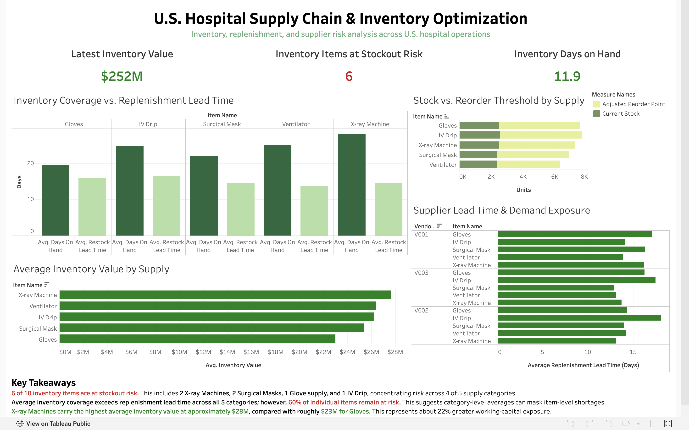

# hospital-supply-chain-analytics
Hospital supply chain analysis using SQL and Tableau to evaluate inventory, replenishment, and supplier risk.
# U.S. Hospital Supply Chain & Inventory Optimization

## Overview
This project analyzes hospital supply chain and inventory data to identify stockout risk, evaluate replenishment needs, and assess the financial impact of inventory decisions. SQL and PostgreSQL were used to develop inventory and replenishment metrics, with Tableau used to visualize operational trends and risk areas.

## Tools
- PostgreSQL
- SQL
- Tableau Public

## Analysis
The analysis focused on several operational measures:

- **Inventory Value:** Current Stock × Unit Cost
- **Days on Hand:** Current Stock ÷ Average Daily Usage
- **Lead-Time Demand:** Average Daily Usage × Restock Lead Time
- **Adjusted Reorder Point:** Lead-Time Demand × 1.20
- **Inventory Status:** Items were classified as Stockout Risk, Potential Overstock, or Healthy based on inventory levels and expected demand.

A 20% safety buffer was incorporated into the reorder point to account for replenishment uncertainty.

## Key Findings
- 6 of 10 inventory items were identified as being at stockout risk, including 2 X-ray Machines, 2 Surgical Masks, 1 Glove supply, and 1 IV Drip.
- Stockout risk was present across 4 of the 5 analyzed supply categories.
- Average inventory coverage exceeded average replenishment lead time across all five categories, showing how category-level averages can mask item-level shortages.
- X-ray Machines had the highest average inventory value at approximately $28M, compared with roughly $23M for Gloves, representing about 22% greater inventory value exposure.
- Supplier lead times varied by approximately 5 days, supporting the use of item- and vendor-specific reorder thresholds rather than a uniform replenishment approach.

## Dashboard

The interactive Tableau dashboard evaluates inventory coverage, reorder thresholds, inventory value, and supplier lead-time exposure.

[View Interactive Tableau Dashboard](https://public.tableau.com/views/U_S_HospitalSupplyChainInventoryOptimization/Dashboard1?:language=en-US&publish=yes&:sid=&:redirect=auth&:display_count=n&:origin=viz_share_link)

## Repository Contents
- `hospital_supply_chain_analysis.sql` — SQL used to calculate inventory and replenishment metrics
- `hospital_supply_chain_analysis.csv` — Processed dataset used for analysis and visualization
